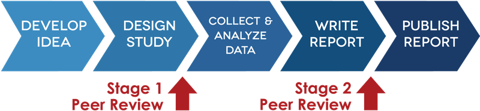
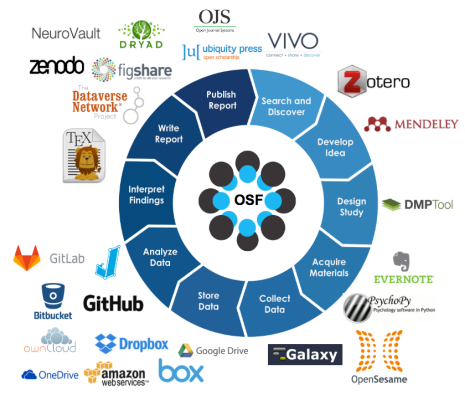

```{r setup, include=FALSE}
knitr::opts_chunk$set(echo = FALSE)
```

# <small> What we did last week... </small>

----

We talked about the scientific <br>
process by looking at the <br>
hypothetico-deductive model

----

Then we talked about how <br>
to make it more open

----

And finally we talked <br>
about potential problems <br>
related to open science

----

Any questions or anything to add?

# <small>Last week's homework</small>

----

Who of you received an email with <br>
a link to the course materials?

----

If not, write me: <br>
<a href="mailto:m.weiler@fu-berlin.de">m.weiler@fu-berlin.de</a>

----

Who of you got an account at the OSF?

----

If not, please do so at <br>
<a href="https://osf.io">https://osf.io</a>

# <small>Preview: The research projects</small>

----

## <small> Planning </small>

- Choose from a list of online <br>experiments and surveys
- Prepare introduction, method <br>section and proposed analysis

## <small> Presentation </small>

- Present your project to the others
- Short talk (5 mins + questions)
- Select the four "best" projects

## <small> Research </small>

- Conduct your study in groups of three
- Add results and discussion

## <small> Final presentation </small>

- Present your results to the others
- Talk or poster session

----

Any questions?

# <small>Today:<br>Digital open scientist's toolbox - Part I</small>

## <small> What makes a tool "open"?</small>

Please take 5 minutes to discuss <br>
your thoughts with two people <br> 
sitting next to you

----

What do you think?

- accessability
- transparence
- reproducability

# <small> Follow up: Mass collaboration </small>

## <small> Many labs replication project </small>

- 36-sites  
- 12-countries  
- 6,344-subjects  
- 10 out of 13 effects replicated  

----

MLRP  

  
<small>Source: https://osf.io/wx7ck/</small>

## <small> Psychological Science Accelerator </small>

<a href="https://psysciacc.wordpress.com/">https://psysciacc.wordpress.com/</a>

----

Lab map  
<a href="https://maphub.net/chartierlab/PSA">https://maphub.net/chartierlab/PSA</a>

# <small> Transparent processes </small>

## <small> Preregistration </small>

Eight questions to preregistration at:  

<a href=https://aspredicted.org/">https://aspredicted.org/</a>

----

Please take 5 minutes to discuss <br>
with your neighbors what you think <br>
would be important questions

----

What's the main question being <br>
asked or hypothesis being tested <br>
in this study?

----

Describe the key dependent <br>
variable(s) specifying how <br>
they will be measured.

----

How many and which conditions <br>
will participants be assigned to?

----

Specify exactly which analyses <br>
you will conduct to examine the <br>
main question/hypothesis.

----

Any secondary analyses?

----

How many observations will be <br>
collected or what will determine <br>
sample size? <br>
No need to justify decision, but <br>
be precise about exactly how the <br>
number will be determined.

----

Anything else you would like to pre-register? <br>
(e.g., data exclusions, variables collected <br>
for exploratory purposes, unusual analyses planned?)

----

Have any data been collected <br>
for this study already?

## <small> Registered reports </small>

----

Registered reports  


<small>Source: https://cos.io/rr/</small>

----

Registered reports  


<small>Source: https://cos.io/rr/</small>

# <small>Online tools</small>

## <small>The Open Science Framework</small>

<a href="https://osf.io">https://osf.io</a>

----

The Open Science Framework  


<small>Source: https://cos.io/our-products/osf/</small>

## <small>Zotero</small>

<a href="https://www.zotero.org/">https://www.zotero.org/</a>

## <small>Sci-hub</small>

<a href="https://en.wikipedia.org/wiki/Sci-Hub">https://en.wikipedia.org/wiki/Sci-Hub/</a>

## <small> The Experiment Factory </small>

<a href="https://expfactory.github.io/expfactory/">https://expfactory.github.io/expfactory/</a>

## <small>Github</small>

<a href="https://github.com/">https://github.com/</a>

## <small>Google docs</small>

<a href="https://www.google.com/intl/en_us/docs/about/">https://www.google.com/intl/en_us/docs/about/</a>

----

to be continued ...

# <small>Any more questions?</small>

# <small>Next week's preview</small>

----

"Scientific pitfalls and how to avoid them"

----

On Thursday at 2:00 p.m.

----

<a href="https://www.youtube.com/watch?v=ZaNtz76dNSI">Interview with researcher</a>

# <small>Homework</small>

----

Please take a look at the <br>
experiments and surveys at <br>
<a href="https://expfactory.github.io/expfactory/">The Experiment Factory</a>

----

If you haven't already:

- Get an account at <a href="https://osf.io">https://osf.io</a>

- Send your email address to <br><a href="mailto:m.weiler@fu-berlin.de">m.weiler@fu-berlin.de</a>


# <small>Thank you for your attention</small>
